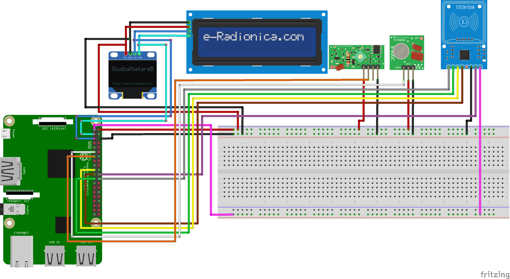

# BDSM Trainer - Control Unit
The BDSM Trainer (i.e. the control unit) is a Raspberry Pi and the software itself is written in Python3. As database server a MySQL server is used (in the beginning I tried it with SQLite, but it had problems with it all the time).

I was inspired by the Fancy Steel Advanced Training Collar and thought that it could be built bigger. Of course some functions are also taken from the literature.

So now the BDSM Trainer was created. Each slave has his own RFID card, with which the slave can log on to the trainer (or his dome). The control unit can process several slaves at the same time and train them completely separately.

Currently the control unit supports the protocols IP/HTTP, IP/HTTPS and the 433 Mhz radio network. Originally the 433 Mhz network was only intended for the dog shock collar. At the moment I am using it to communicate with an Arduino, but it does not work very well. In the end the 433 radio network should only be there for the collar. 

What is still to come:
* Integration of buttplug.io
* Integration of shock collars
* Other game modes
* API for external app.
* Many many devices to train the slave better
* Saving a complex training plan
* whatever else comes to mind. 

With pleasure I take up further ideas or can develop new ideas together ...

# Required components

* Raspberry 3+ or better (WLAN required)
* LCD-i2c (as info screen)
* XY-FST Sender or better (my recommendation: H34A) (433 Mhz sender) 
* XY-MK-5V Receiver or better (my recommendation: H3V4F) (433 Mhz receiver)
* 128 x 64 OLED display 0,96"
* RFID-RC522 (RFID Receiver)

# Stripboard

# Status
Still under strong development, but functional

# Disclaimer
All devices listed here are for study purposes only. Please do not use them on living creatures. I take no responsibility if anything happens. And always remember, safety and health comes first.